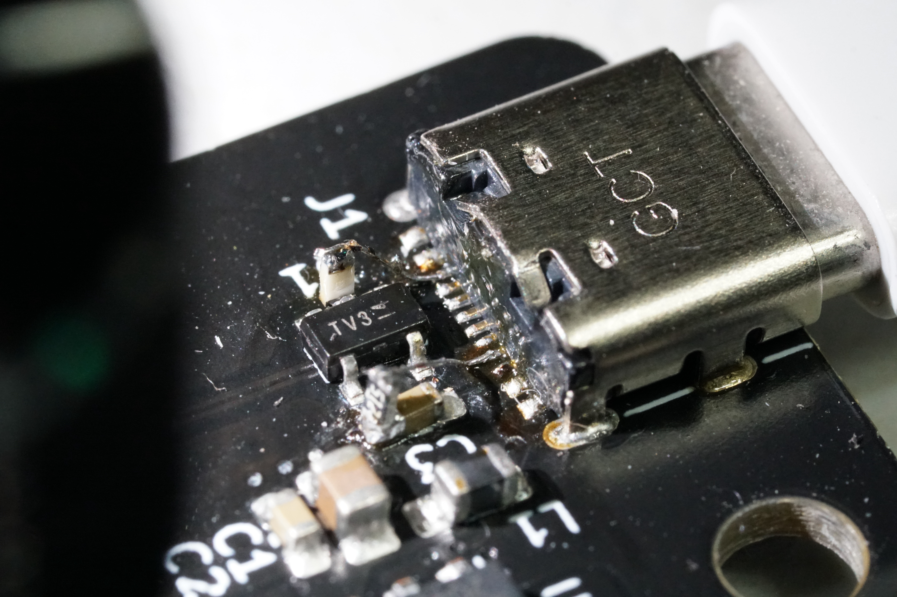

# PCB

## Hacking
There are ten extra pins on the board marked "Expansion," and they're there so you can add extra inputs or whatever you want to the board. Three are power (5V, 3.3V, GND), and the other seven are connected to pins on the MCU (all have ADCs). The Arduino board definition is based off of the DUE, so take a look at the [DUE schematic](https://www.arduino.cc/en/uploads/Main/arduino-Due-schematic.pdf) or [variant.cpp](https://github.com/ucsbieee/ArduinoCore-SAM3A4C/blob/master/variants/arduino_due_x/variant.cpp) to see which Arduino pins they map to.

## If you want to make more

There should be a few extra unpopulated boards in the lab somewhere. See BOM.csv for a list of parts you'll need. Parts without a DigiKey part number are generic stuff. Most resistors and caps are 0603, with a few 0805 (see footprint column).

You'll also likely want to use a solder paste stencil, especially for the BGA microcontroller. A file for the stencil is in the Gerber folder.

If you guys ever build a Tesla Coil symphony with a bunch of these things, please invite me back, I want to see :)

## Required Bodges

If you decide to re-order the boards, it would be a good idea to fix these issues.

### Headphone Output
As designed, the headphone output is asymmetric and pretty loud. Depending on how sensitive your headphones are, you may want to make R17 10kΩ instead of 2.2kΩ. To make the output symmetric and sound better, prop up Q1 at an angle and put a 10kΩ (same as R17) resistor between pin 3 and the pad on the board. This is pretty easy if you do it before melting the solder paste.

### USB-C Power
Apparently, USB-C needs some 5.1kΩ pull-down resistors on the CC pins before the host will deliver 5V. If you plug in the board as designed, it probably won't turn on. To fix this, you'll need to solder some very fine wires to pins A5 (fourth from the right) and B5 (third from the left) of the USB-C port and run them to some 5.1kΩ resistors to ground. This is quite difficult because of how small the pins on the port are but it's doable.

